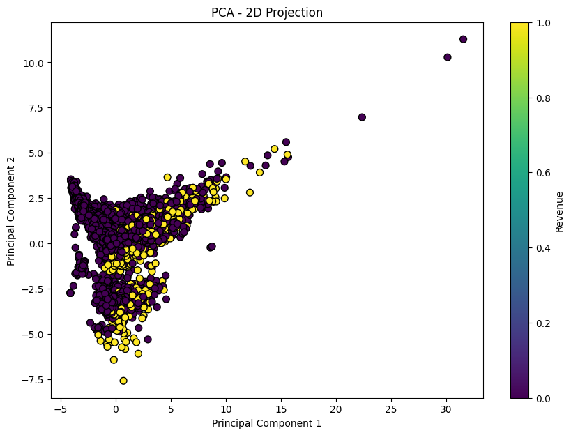

## Data Mining Course Projects

### P3: Customers Behavior Analysis in an E-commerce
- **Data Cleaning**
- **Classification** using Regression
- **Dimensionality Reduction** using PCA
- **Over Sampling** using **SMOTE**
- Trained Classifers: **SVM**, **KNN**, **Logistic Regression**, **Decision Tree** as training classifiers
- Used **Grid Search** for each classifiers
- Used **Cross Validation** for Grid Search
- Used Bar Plot to show each classifiers **Accuracy**, **Precision**, **F1 Score**, and **roc_auc Score**
- Useed Confusion Matrix plot for

- **Clustering** using **K-means** and **DBSCAN** to identify groups of customers with similar characteristics
- Used **Silhouette** Score to measure Cohesion

### P2.1: House Price Prediction
- Preprocessed Pandas Data Frame
- Visualized Data Distribution using Histogram
- Visualized Data Correlation using Pair Plot and **Heatmap**
- Trained Model using **Linear Regression**, **Polynomial Regression**, **Ridge Regression**, **Lasso Regression**, **Elastic Net Regression**, and **XGBoost Regression**
- Evaluate Model Prediction using Mean Squared Error(**MSE**), and **R2 Score**
- Libraries: **NumPy**, **Pandas**, **Matplotlib**, **Seaborn**, and **scikit-learn**

### P2.2: Market Basket Analysis
- Used **MLXtend** library
- Applied **TransactionEncoder**
- Generate Frequent Itemsets using **Apriori** algoirthm
- Generate **Association Rules**

### P1: Preprocessing and Visualizing Dataset
- Libraries: **NumPy**, **Pandas**, **Matplotlib**, **Seaborn**, and **scikit-learn**
- Preprocessed Dataset
- Visualized Dataset using **Scatter Plot**, **Histogram**, **Box Plot**, and **Pair Plot**
- Encoded and Normalized Dataset
- Implemented Principal Component Analysis(**PCA**) from scratch
- Visualized PCA-reduced Data

    
    
    

